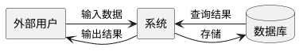
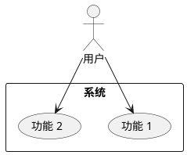
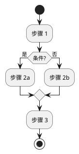
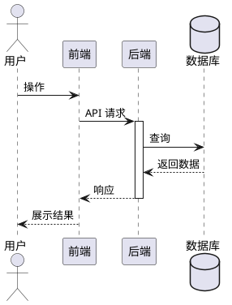

# PlantUML 生成提示词模板

以下是各类图的生成指令，Claude 在阶段 3 中参考这些提示词生成对应的 PlantUML 代码。

---

## 数据流图（DFD）

根据文档中的核心业务流程，生成数据流图。要求：
- 用 `rectangle` 表示外部实体
- 用 `database` 表示数据存储
- 用箭头标注数据流向和数据名称
- 保持层次清晰，不超过 2 层

---

## 用例图（Use Case）

根据文档中的用户故事和核心功能，生成用例图。要求：
- 每个目标用户对应一个 actor
- 每个核心功能对应一个 usecase
- 用 `-->` 表示 include/extend 关系

---

## 活动图（Activity）

根据文档中的核心业务流程，生成活动图。要求：
- 用 `start` / `stop` 标注起止
- 用 `if` / `else` 表示分支
- 保持流程线性，避免过多交叉

---

## 时序图（Sequence）

根据文档中的模块划分和接口定义，生成时序图。要求：
- 参与者为系统中的主要模块或角色
- 标注每条消息的方法名或数据名
- 用 `activate` / `deactivate` 表示生命周期

